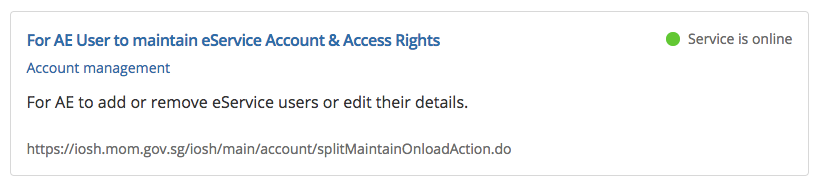

# 📚  Web Components Primer


**A Guide for learning about Web Components**

While there are already many resources available shedding light into Web Components, much of the information is fragmented, outdated, or centered around a particular framework. This document aims to provide an up-to-date, general overview into the Web Components v1 specification. There are also links to other helpful resources throughout the guide. 


---


## Table of contents

- **What are Web Components?**
  - HTML Imports
  - HTML Templates
  - Shadow DOM
  - Custom Elements
- **Life with Web Components**
- **Features and Benefits** 
  - Code encapsulation
  - Consistency
  - Reusability
  - Portability
- **Using Web Components Today**
- **API introduction**
  - Attributes
  - Lifecycle methods
  - Custom element registry
- **Creating and using a Custom Element**
- **Best practices**
- **Case studies**
- **Resources**


---


## What are Web Components?

The term "Web Components" refers to a W3C browser specification. It's aim: enable developers to create reusable custom user interface components for the web. The specification itself consists of four different technologies: HTML Imports, HTML Templates, Shadow DOM and Custom Elements.


### HTML Imports

> [HTML Imports](http://w3c.github.io/webcomponents/spec/imports/), part of the [Web Components](http://w3c.github.io/webcomponents/explainer/) cast, is a way to include HTML documents in other HTML documents. You're not limited to markup either. An import can also include CSS, JavaScript, or anything else an `.html` file can contain. In other words, this makes imports a **fantastic tool for loading related HTML/CSS/JS**.
>
> -- *https://www.html5rocks.com/en/tutorials/webcomponents/imports/*

**Example:**

 ````
<link rel="import" href="includes/header.html">
 ````

**Further reading:** [**Exploring HTML Imports**](http://robdodson.me/exploring-html-imports/)


### HTML Templates

> The **HTML `<template>` element** is a mechanism for holding client-side content that is not to be rendered when a page is loaded but may subsequently be instantiated during runtime using JavaScript.
>
> -- *https://developer.mozilla.org/en-US/docs/Web/HTML/Element/template*

**Further reading:** [**Introduction to the template elements**](https://www.webcomponents.org/community/articles/introduction-to-template-element)


### Shadow DOM

> Shadow DOM provides encapsulation for DOM and CSS in a [Web Component](https://developer.mozilla.org/en-US/docs/Web/Web_Components). Shadow DOM makes it so these things remain separate from the DOM of the main document. You can also use Shadow DOM by itself, outside of a web component.
>
> -- https://developer.mozilla.org/en-US/docs/Web/Web_Components/Shadow_DOM

**Further reading:** [**Shadow DOM v1: Self-Contained Web Components**](https://developers.google.com/web/fundamentals/web-components/shadowdom)


### Custom Elements

> Custom Elements is a **capability for creating your own custom HTML [elements](https://developer.mozilla.org/en-US/docs/Glossary/Element)**. They can have their own scripted behavior and CSS styling. They are a part of [web components](https://developer.mozilla.org/en-US/docs/Web/Web_Components), but can also be used by themselves.
>
> -- https://developer.mozilla.org/en-US/docs/Web/Web_Components/Custom_Elements

> Custom Elements let you **extend HTML and define your own tags**. If you’re familiar with building components in Angular or React, creating a Custom Element should feel similar. The primary difference is that they’re native to the browser and based on a [W3C spec](https://www.w3.org/TR/custom-elements/). Because of this, they should be able to work in any context where HTML works. This includes being used by the aforementioned frameworks.
>
> -- https://medium.com/dev-channel/the-case-for-custom-elements-part-1-65d807b4b439

**Example:**

```html
<share-buttons>
  <social-button type="twitter"><a href="...">Twitter</a></social-button>
  <social-button type="fb"><a href="...">Facebook</a></social-button>
  <social-button type="plus"><a href="...">G+</a></social-button>
</share-buttons>
```

**Further reading:** [**Custom Elements v1: Reusable Web Components**](https://developers.google.com/web/fundamentals/web-components/customelements)


---


## Life with Web Components

### Example 1: Service status card

Consider the following markup for a "card" which displays the status of some online services:





```html
<article>
  <div class="service-status service-status-small">
    <div class="service-status-text">
      Service is online
    </div>
  </div>

  <h2 class="item-title">
    <a href="https://iosh.mom.gov.sg/iosh/main/account/splitMaintainOnloadAction.do" target="_blank">
      For AE User to maintain eService Account &amp; Access Rights
  	</a>
  </h2>

  <div class="article-meta">
    <a href="/eservices?category=Account+management">Account management</a>    
  </div>

  <p>
    For AE to add or remove eService users or edit their details.
  </p>

  <p class="item-url">
    <a href="https://iosh.mom.gov.sg/iosh/main/account/splitMaintainOnloadAction.do" target="_blank">https://iosh.mom.gov.sg/iosh/main/account/splitMaintainOnloadAction.do</a>
  </p>
</article>
```


Using web components, we are able to reduce the number of classes, attributes and properties that developers are required to apply to the markup (this is just one possible way of consuming this theoretical Custom Element.

```html
<service-status-card status="online" card-size="small"
  card-title="For AE User to maintain eService Account & Access Rights"
  card-description="For AE to add or remove eService users or edit their details."
  card-url="https://iosh.mom.gov.sg/iosh/main/account/splitMaintainOnloadAction.do"
>
  <div slot="meta">
    <a href="/eservices?category=Account+management">Account management</a>
  </div>
</service-status-card>
```


You may be wondering about `card-size="small"`. Controlling presentation/styling via an element's attributes seems like a regression. Back in the day, we used attributes like `size` to control the `font-size` on HTML elements. This is now deprecated and the community has agreed that styling should only live in CSS.

However, there are some advantages to using this approach. In the Custom Element API, authors have the ability to programmatically render the element based on the value or presence of certain attributes. This can be very powerful if the Custom Element API is designed in a clever way. In reality, it is up to the element's author to design an API that suits the needs of the element consumers. (i.e. it may be better to use slots instead of attributes for certain data).


### Example 2: Navigation

Let's take a look at another example. Consider the following markup for a navigation area:


```html
<div>
  <a href="#primary-navigation" class="link-menu js-menu-toggle"><span>Menu</span></a>
  <div id="primary-navigation" class="main-navigation">
    <nav class="nav-main">
      <a href="/passes-and-permits" class="link-has-image">
        <div class="nav-icon">
          
        </div>
        <span>Work passes and permits</span>
      </a>
                
      <a href="/employment-practices" class="link-has-image">
        <div class="nav-icon">
          
        </div>
        <span>Employment practices</span>
      </a>
                
      <a href="/workplace-safety-and-health" class="link-has-image">
        <div class="nav-icon">
          
        </div>
        <span>Workplace safety and health</span>
      </a>
    </nav>
  </div>
</div>
```


Using Custom Elements and together with the rest of the Web Component spec, we can achieve the same result with simpler markup:

```html
<primary-navigation button-text="Menu">
  <icon-link href="/passes-and-permits" icon="passes-and-permits">
    Work passes and permits
  </icon-link>
  
  <icon-link href="/employment-practices" icon="employment-practices">
    Employment practices
  </icon-link>
  
  <icon-link href="/workplace-safety-and-health" icon="workplace-safety">
    Workplace safety and health
  </icon-link>
</primary-navigation>
```


---


## Features and benefits 

### Encapsulation

Web Components provide developers with the ability to encapsulate markup and structure (HTML), styling (CSS), and logic + interactivity (JS) required for rendering a reusable piece of UI, out into reusable Custom Elements. Using Custom Elements, developers only need to worry about the **essential pieces of moving data**.

As a result, they can **code faster**, and **reduce errors** in code when it comes to writing and editing markup for rendering the UI.

### Consistency

Because code is encapsulated into each component, there is **confidence** that each instance of the component is rendered consistently.

### Portability

Web Components are a **native browser specification**, which means they can be used with regular HTML or with any kind of framework. This empowers developers across a large organization, who may be using **different stacks**, to build **coherent digital products**.


---


## Using Web Components today

What about browser support? Can we use Web Components right now?

**The short answer is yes;** With a polyfill.

[**webcomponents.js**](https://github.com/webcomponents/webcomponentsjs) is lightweight and supports all modern browsers.


---


## API introduction

Let's take a brief look into the Custom Elements v1 API.


### Custom Element registry

#### [`CustomElementRegistry`](https://developer.mozilla.org/en-US/docs/Web/API/CustomElementRegistry)

Interface that provides methods for registering and querying custom elements.

#### `window.customElements`

Returns a reference to `CustomElementRegistry`.

#### `window.customElements.define(name, constructor, options)`

Method to define a new Custom Element.

#### `window.customElements.get(name)`

Method to return the constructor of a previously defined Custom Element.

#### `window.customElements.whenDefined(name)`

Method to return a Promise that resolves when a Custom Element of the specified name is defined.


### Custom Element lifecycle methods

#### `constructor()`

Called when the element is created.

#### `connectedCallback()`

Called when the element is added to the DOM.

#### `disconnectedCallback()`

Called when the element is removed from the DOM.

#### `adoptedCallback(oldDocument, newDocument)`

Called when the element is adopted into a new document.

#### `attributeChangedCallback(attr, oldVal, newVal)`

Called when one of the element's `observedAttributes` changes.


### Working with attributes/properties

#### `static get observedAttributes()`

Inside the Custom Element class definition, define a static getter, `observedAttributes()`. This should return an array of attributes which will fire the element's  `attributeChangedCallback()` when their value changes.

#### `get ${attributeName}() `

Getter methods defined in the Custom Element class are called when the element's property of the same name is programmatically accessed.

#### `set ${attributeName}()`

Setter methods defined in the Custom Element class are called when the element's attribute or property of the same name is updated.


### Working with slots

#### `element.assignedSlot`

Returns the [`HTMLSlotElement`](https://developer.mozilla.org/en-US/docs/Web/API/HTMLSlotElement) interface associated with the element.

#### `HTMLSlotElement.name`

Returns the name of the slot.

#### `HTMLSlotElement.assignedNodes()`

Returns either the sequence of elements assigned to this slot, or the slot's fallback content.

#### `slot.addEventListener('slotchange', cb)`

Slots have a `slotchange` event which fires when nodes in the slot change.


---


### Creating and using a Custom Element

Let's create a Custom Element called  `<popout-nav>` . We'll aim to be able to use it like this:

**`index.html`**

```html
<!-- Default usage -->
<dropdown-menu>
  <h3>Pages</h3>
  <a role="menuitem" href="/home">Home</a>
  <a role="menuitem" href="/about">About</a>
  <a role="menuitem" href="/contact">Contact</a>
  <h3>Actions</h3>
  <a href="#copy">Copy</a>
  <a href="#paste">Paste</a>
</dropdown-menu>

<!-- Custom button text -->
<dropdown-menu button-text="Site Navigation">
  <a href="/home">Home</a>
  <a href="/about">About</a>
  <a href="/contact">Contact</a>
</dropdown-menu>

<!-- Disabled with custom button text -->
<dropdown-menu disabled button-text="Sign in to access menu">
  <a href="/home">Home</a>
  <a href="/about">About</a>
  <a href="/contact">Contact</a>
</dropdown-menu>
```


**`popout-nav.html`**

```html
<!-- Set id on template for FF compatbility -->
<template id="dropdown-menu">

  <!-- Import the Custom Element stylesheet inside the template tag -->
  <link rel="stylesheet" href="dropdown-menu/dropdown-menu.css">
    
<!--
    We will rewrite the `<button>` `textContent`  
    with the element's `button-text` attribute.
-->
    <button id="button" aria-pressed="false" aria-haspopup="true" aria-controls="menu"></button>
    
<!--
    `<popup-nav>`s children will be rendered into `<slot>`. 
    We give an id of "menu" so we can query the `<div>` with JS later.
-->
    <div id="menu" role="menu" hidden>
      <slot></slot>
    </div>
    
</template>

<!-- Import Custom Element scripts outside of the template tag -->
<script src="dropdown-menu.js"></script>
```


**`popout-nav.js`**

```javascript
// Wrap our script in an IIFE for scoping
(function() {

  // When a script block of an imported document is executed,
  // `document` refers to the importing document,not the imported document.
  // In our case though, we want to get the template in the imported document
  // (ourself). We do that by using `document.currentScript.ownerDocument`.
  const importedDocument = document.currentScript.ownerDocument;

  // Keycodes for keyboard interaction
  const KEYCODES = {
    ESC   : 27,
    LEFT  : 37,
    UP    : 38,
    RIGHT : 39,
    DOWN  : 40
  };

  class DropdownMenu extends HTMLElement {
    
    // When the element's `button-text` or `disabled` attributes 
    // change, `attributeChangedCallback()` is called.
    static get observedAttributes() {
      return ['button-text', 'disabled'];
    }
    
    ///
    // Define getters and setters for each attribute
    ///
    get buttonText() {
      return this.getAttribute('button-text') || 'Menu';
    }
    
    set buttonText(val) {
      this.setAttribute('button-text', val);
    }
    
    get disabled() {
      return this.hasAttribute('disabled');
    }
    
    set disabled(val) {
      // Reflect the value of the disabled property as a HTML attribute.
      if (val) {
        this.setAttribute('disabled', '');
      } else {
        this.removeAttribute('disabled');
      }
    }
    
    // `constructor()` is called when
    // the element is created.
    constructor() {

      // Always call `super()` in the `constructor()`.
      super();

      // Create and attach the Shadow DOM
      const shadow = this.attachShadow({mode: 'open'});

      // Clone and append the `<template>` contents into the Shadow DOM
      const template = importedDocument.querySelector('template');
      const clone = template.content.cloneNode(true)
      shadow.appendChild(clone);

      // Initialise the Custom Element state
      this.state = {
        isMenuOpen: false
      };
      
      // Cache references to ShadowDOM children
      this.$button = shadow.getElementById('button');
      this.$menu   = shadow.getElementById('menu');

      // Attach the click event for the toggle button
      this.$button.addEventListener('click', () => {
        this._toggleMenu();
      });

      // Add initial aria attributes
      if (!this.hasAttribute('aria-expanded')) this.setAttribute('aria-expanded', false);
    }
    
    // `connectedCallback()` is called when
    // the element is added to the DOM.
    connectedCallback() {
      this._renderButton();
    }
    
    // `attributeChangedCallback()` is called when 
    // one of the element's `observedAttributes` changes.
    attributeChangedCallback(name, oldVal, newVal) {

      // Use a `switch` statement to do different things
      // based on the attribute that changed.
      switch(name) {
        case 'button-text':
          this._renderButton();
          break;
        case 'disabled':
          if(this.disabled) this._closeMenu();
          this._renderButton();
          break;
      }
      
    }
    
    // `disconnectedCallback()` is called when
    // the element is removed from the DOM.
    disconnectedCallback() {
    }
    
    ///
    // In addition to the lifecycle callbacks, 
    // we can also define our own internal methods:
    ///
    _renderButton() {
      // Update the button text
      this.$button.textContent = this.buttonText;

      // Set the button state
      if(this.disabled) {
        this.$button.disabled = true;
      } else {
        this.$button.disabled = false;
      }
    }

    _toggleMenu() {
      // Toggle the menu based on current state
      if(this.state.isMenuOpen) {
        this._closeMenu();
      } else {
        this._openMenu();
      }
    }

    _openMenu() {
      // Update aria attributes
      this.setAttribute('aria-expanded', true);
      this.$button.setAttribute('aria-pressed', true);

      // Unhide the menu
      this.$menu.hidden = false;

      // Bind keydown events to make menu keyboard accessible
      this.addEventListener('keydown', this._handleMenuKeydown.bind(this));

      // Close the menu if a click event is receive anywhere outside of the Custom Element
      document.addEventListener('click', this._handleClickOutsideMenu.bind(this));

      // Update state
      this.state.isMenuOpen = true;
    }

    _closeMenu() {
      // Update aria attributes
      this.setAttribute('aria-expanded', false);
      this.$button.setAttribute('aria-pressed', false);

      // Unhide the menu
      this.$menu.hidden = true;

      // Remove previously assigned event listeners
      this.removeEventListener('keydown', this._handleMenuKeydown);
      this.removeEventListener('click', this._handleClickOutsideMenu);

      // Update state
      this.state.isMenuOpen = false;
    }

    _handleMenuKeydown(event) {
      switch(event.keyCode) {
        case KEYCODES.ESC :
          this._closeMenu();
          break;
      }
    }

    _handleClickOutsideMenu(event) {
      if(event.target !== this) this._closeMenu();
    }

  }

  // Finally, register the Custom Element with `customElements.define()`
  // so we can use the custom `<popout-menu>` element in our HTML.
  customElements.define('dropdown-menu', DropdownMenu);
})();
```


**`popout-nav.css`**

```css
/* :host selector targets the root of the Custom Element */
:host {
  display: block; /* If not set, defaults to `inline` */
}

/* It is a good practice to apply the `display: none` style
   to the :host element if it has the `hidden` attribute set. */
:host([hidden]) {
  display: none;
}

/* Google says it's a best practice to use simple selectors in Web Components.
   These selectors are scoped to the Shadow DOM and will not leak out */
#menu {
  position: absolute;
  top: 100%;
  left: auto;
  margin: 0;
  display: flex;
  flex-direction: column;
  transition: max-height 0.25s ease-in-out, opacity 0.25s ease-in-out;
  min-width: 100%;
  max-height: 100vh;
  opacity: 1;
  border: 1px solid lightgrey;
  box-shadow: var(--dropdown-menu-box-shadow, 0 3px 6px -1px rgba(0,0,0,0.2));
  background: white;
  z-index: 10000;
}

#menu[hidden],
#menu:host-context([disabled]) {
  visibility: hidden;
  max-height: 0;
}

#menu[hidden] {
  transition: none;
  opacity: 0;
}

#button {
  display: inline-block;
  cursor: pointer;
  -webkit-appearance: var(--dropdown-menu-button-appearance, none);
  appearance: var(--dropdown-menu-button-appearance, none);
  padding: var(--dropdown-menu-button-padding, 0.5em 1em);;
  border: var(--dropdown-menu-button-border, none);
  background: var(--dropdown-menu-button-bg, black);
  color: var(--dropdown-menu-button-text-color, white);
  font-size: var(--dropdown-menu-button-size, inherit);
  font-weight: var(--dropdown-menu-button-weight, normal);
  border-radius: var(--dropdown-menu-button-radius, 4px);
}

#button[disabled] {
  background: var(--dropdown-menu-button-bg, grey);
  color: var(--dropdown-menu-button-text-color, lightgrey);
  cursor: not-allowed;
}

/* ::slotted targets elements in a <slot> */
::slotted(*) {
  margin: 0;
  padding: 0.5em 1.5em;
  border-top:
    var(--dropdown-menu-item-border-width, 1px)
    var(--dropdown-menu-item-border-style, solid)
    var(--dropdown-menu-item-border-color, #EEEEEE);
}

::slotted(*:first-child) {
  border-top: none;
}

::slotted(a) {
  display: block;
  color: var(--dropdown-menu-link-text-color, #3A3A3A);
  background: var(--dropdown-menu-link-bg, #FFFFFF);
  text-decoration: var(--dropdown-menu-link-text-decoration, none);
}

::slotted(a:hover) {
  color: var(--dropdown-menu-link-text-color-hover, #000000);
  background: var(--dropdown-menu-link-bg-hover, #EEEEEE);
  text-decoration: var(--dropdown-menu-link-text-decoration-hover, none);
}
```


---


## Best practices

- When authoring Custom Elements, focus on the consumer API instead of the internal implementation. As authors, we should strive to minimize breaking changes for consumers of our elements.
- [**Web Components Best Practices**](https://www.webcomponents.org/community/articles/web-compo- nents-best-practices)
- [**Custom Element Best Practices**](https://developers.google.com/web/fundamentals/web-components/best-practices)


---


## Resources

- **Videos**
  - [Building UI at Enterprise Scale with Web Components (Polymer Summit 2017)](https://www.youtube.com/watch?v=FJ2KEvzlyo4)
  - [Practical lessons from a year of building web components - Google I/O 2016](https://www.youtube.com/watch?v=zfQoleQEa4w)
  - [Building web applications with Web Components by Martin Splitt](https://www.youtube.com/watch?v=0FstJG9t5v0)
- **Examples**
  - [web-presentation](https://github.com/ChristianKohler/web-presentation)
- **Libraries**
  - [Brick](https://github.com/mozbrick/brick)
  - [Project Elix](https://github.com/elix/elix)
- **Frameworks**
  - [Google Polymer](https://www.polymer-project.org/)
  - [Slim.js](http://slimjs.com/)
  - [X-Tag](https://x-tag.github.io/)
  - [Skate.js](https://github.com/skatejs/skatejs)
  - [Stencil](https://github.com/ionic-team/stencil)
- **Tools**
  - [web-component-tester](https://github.com/Polymer/web-component-tester)
  - [polymer-bundler](https://github.com/Polymer/polymer-bundler)
  - [polyserve](https://github.com/Polymer/polyserve)
  - [polymer-cli](https://github.com/Polymer/polymer-cli)
- **Further reading**
  - [Component.Kitchen](https://component.kitchen/blog)
  - [Server Components](https://github.com/pimterry/server-components)
  - [Web Components the Right Way](https://github.com/mateusortiz/webcomponents-the-right-way)
  - [Webcomponents.org](https://webcomponents.org)
